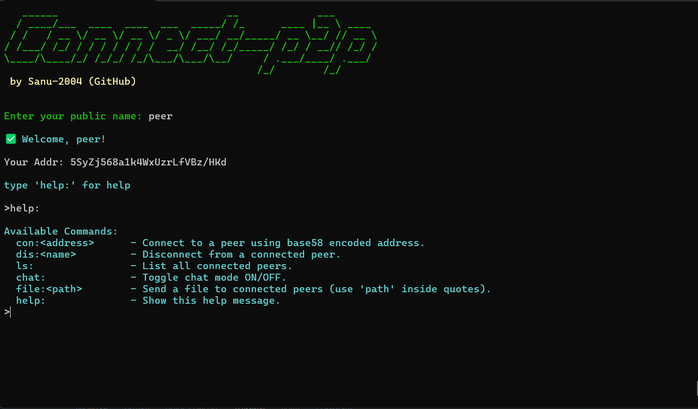

# Connect-P2P

<p align="center">
  
</p>

## Table of Contents

- [Introduction](#introduction)
- [Features](#features)
- [Dependencies](#dependencies)
- [Project Structure](#project-structure)
- [Getting Started](#getting-started)
    - [Prerequisites](#prerequisites)
    - [Building the Project](#building-the-project)
    - [Running the Project](#running-the-project)
- [Usage](#usage)
- [Contributing](#contributing)
- [License](#license)

## Introduction

Connect-P2P is a peer-to-peer (P2P) file sharing and chat application built using Rust. This project leverages various Rust libraries to provide a robust and efficient P2P communication platform.

## Features

- **File Sharing**: Send and receive files between peers.
- **Chat**: Real-time chat functionality with connected peers.
- **Progress Indicators**: Visual progress indicators for file transfers.
- **Secure Hashing**: File integrity verification using Blake3 hashing.

## Dependencies

The project uses the following dependencies:

- `tokio`: Asynchronous runtime for Rust.
- `rand`: Random number generation.
- `serde`: Serialization and deserialization.
- `bincode`: Binary encoding.
- `chrono`: Date and time handling.
- `bs58`: Base58 encoding.
- `blake3`: Cryptographic hashing.
- `indicatif`: Progress bars.
- `crossterm`: Cross-platform terminal manipulation.

## Project Structure

The project is organized as follows:

- `main.rs`: Entry point of the application.
- `packet/`: Contains modules related to packet handling.
  - `chat.rs`: Handles chat packets.
  - `file.rs`: Handles file packets.
  - `mod.rs`: Packet module definitions.
- `stun.rs`: Handles STUN (Session Traversal Utilities for NAT) functionality.
- `user/`: Contains user-related modules.
  - `command.rs`: Handles user commands.
  - `mod.rs`: User module definitions.
  - `peer.rs`: Handles peer-related functionality.

## Getting Started

### Prerequisites

- Rust and Cargo installed on your system. You can install Rust from [here](https://www.rust-lang.org/tools/install).

### Building the Project

To build the project, run the following command in the project directory:

```sh
cargo build
```

### Running the Project

To run the project, use the following command:

```sh
cargo run
```

## Usage

### File Sharing

To share a file, use the following command:

```sh
file: <file_path>
```

### Chat

To start a chat session, use the following command:

```sh
chat:
```

## Contributing

We welcome contributions! Please see [CONTRIBUTING.md](CONTRIBUTING.md) for more details.

## License

This project is licensed under the MIT License. See the [LICENSE](LICENSE) file for details.